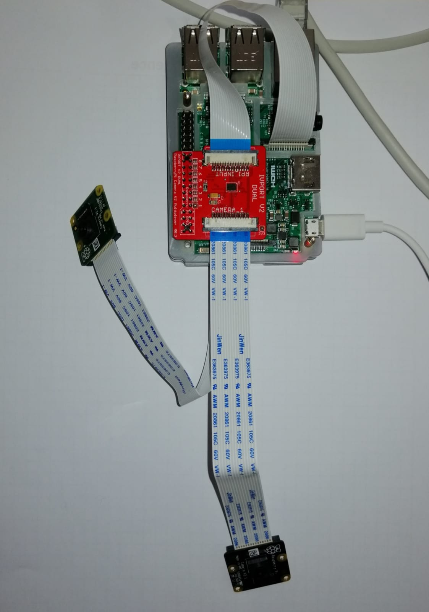
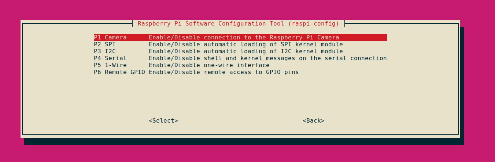

# rpi-ivport

Repozitorij je kreiran na Raspberry Pi, Model B VI.2.

OS : Ubuntu Mate 18.04., ROS Melodic.
Na Raspberry Pi računalo je spojen multipleksor IVPort Dual2 sa dvije kamere tipa Raspberry Pi Camera V2.

https://ivmech.com/magaza/en/development-modules-c-4/ivport-dual-v2-raspberry-pi-camera-module-v2-multiplexer-p-109

Povezivanje kamera, IV porta i Rpi pločice ostvareno je pomoću iv-portV2 skripti preuzetih sa:
https://github.com/ivmech/ivport-v2

Komununikacija kamera i ROS-a je ostvarena u `rpi-ivport/src/camera_publish_node.py` uz pomoć paketa iv-portV2. Node šalje message tipa Image na rosmaster.

Pretpostavlja se se da je omogućeno povezivanje laptopa i Rpi pomoću `ssh` protokola.


```
 ssh ivona rpi@192.168.21.114                                                                                                     
ivona-rpi@192.168.21.114's password:
Welcome to Ubuntu 18.04.4 LTS (GNU/Linux 4.15.0-1060-raspi2 armv7l)

ivona-rpi@ivonarpi-desktop:~$
```

#### Kreiranje workspace-a:
```  
  cd
  mkdir -p ~/your_ws/src
  cd your_ws
  catkin_make
```
#### Skidanje paketa:
```
 cd ~/your_ws/src
 git clone https://github.com/IvonaKr/rpi-ivport.git
 cd ..
 catkin_make
```
#### Pokretanje kamere i povezivanje s ROS-om na Rpi-ju

Za pokretanje kamera se podrazumijeva da na Rpi-ju postoji Ubuntu OS sa instaliranim ROS-om.

Prije spajanja Rpi-ja i laptopa s eternet kabelom, potrebno je spojiti Rpi, multipleksor, kamere i flat kabel kao na slici. Obratiti pozornost na plavi dio kabela u CSI camera portu, to je izolacijski dio  i on "gleda prema van". Pažljivo spojiti multipleksor sa GPIO Headers.



Nakon povezivaja Rpi-ja i laptopa potrebno je omogućiti Camera i I2C Interface uz pomoć konfiguracijiskog alata `raspi-config`. Izabrati `Interfacing Options`.

```
  sudo raspi-config

```


```
  sudo reboot now
```
```
  sudo apt-get update
  sudo apt-get install -y python-smbus i2c-tools
  sudo halt

```
#### Povezivanje kamera i ROS-a

```
 cd ~/your_ws/src/rpi-ivport/src
```
Skripta  `init_ivport.py` se treba pokrenuti svaki puta prilikom ukljucivanja kamera.
 ```
 python init_ivport.py
```
Naredbe za provjeru uspješnog povezivanja:
```
 i2cdetect -y 1
```
gdje je ispravan rezultat :
```
0  1  2  3  4  5  6  7  8  9  a  b  c  d  e  f
00:          -- -- -- -- -- -- -- -- -- -- -- -- --
10: 10 -- -- -- -- -- -- -- -- -- -- -- -- -- -- --
20: -- -- -- -- -- -- -- -- -- -- -- -- -- -- -- --
30: -- -- -- -- -- -- -- -- -- -- -- -- -- -- -- --
40: -- -- -- -- -- -- -- -- -- -- -- -- -- -- -- --
50: -- -- -- -- -- -- -- -- -- -- -- -- -- -- -- --
60: -- -- -- -- 64 -- -- -- -- -- -- -- -- -- -- --
70: 70 -- -- -- -- -- -- --
```
te :
```
 vcgencmd get_camera
```
potreban rezultat  :
```
supported=1 detected=1
```
Pokretanje ROS noda za objavljivanje topica `/camera_topic1` i `/camera_topic2` tipa `Image`.
 ```
  roscore
  rosrun rpi-ivport camera_publish_node.py

```
